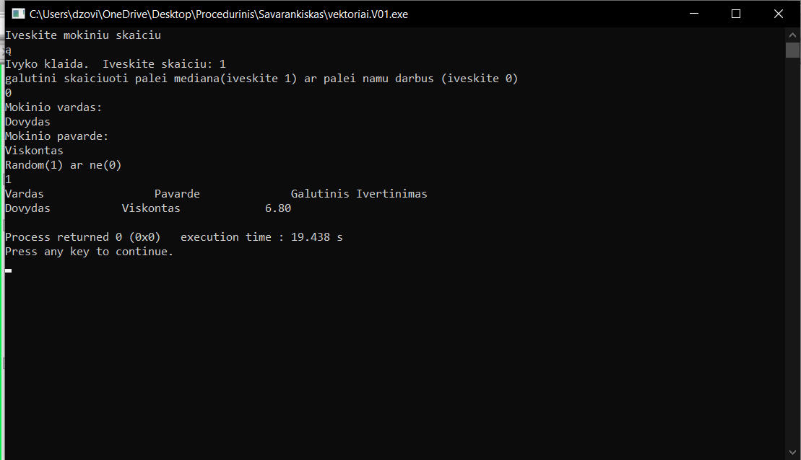
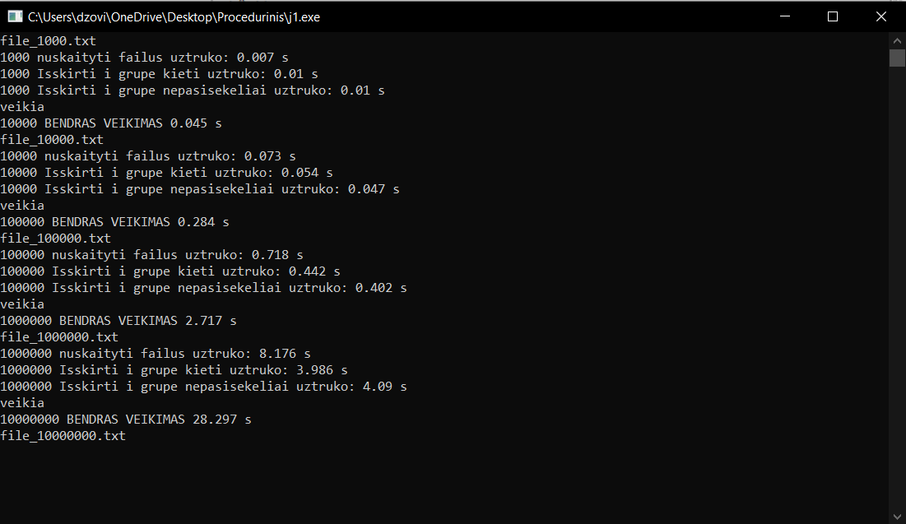
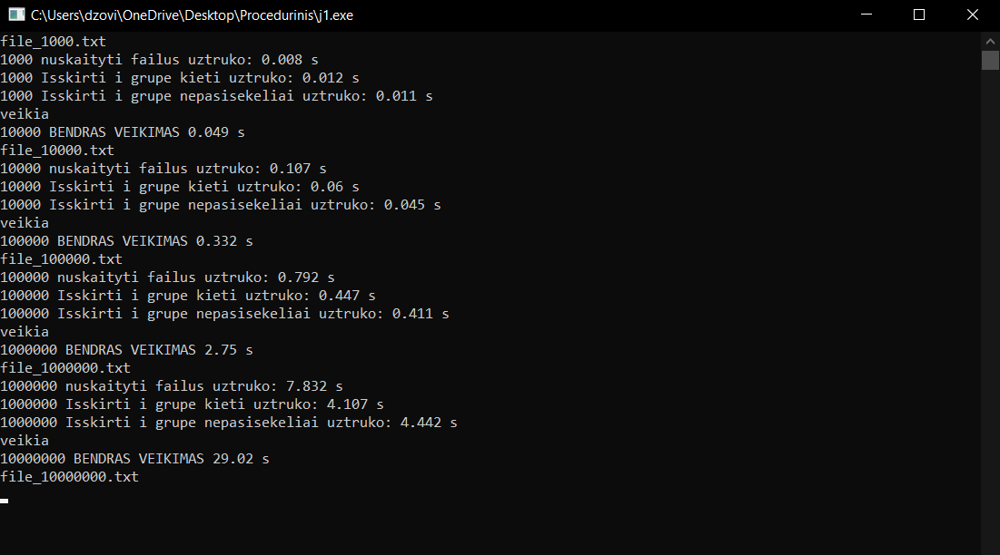
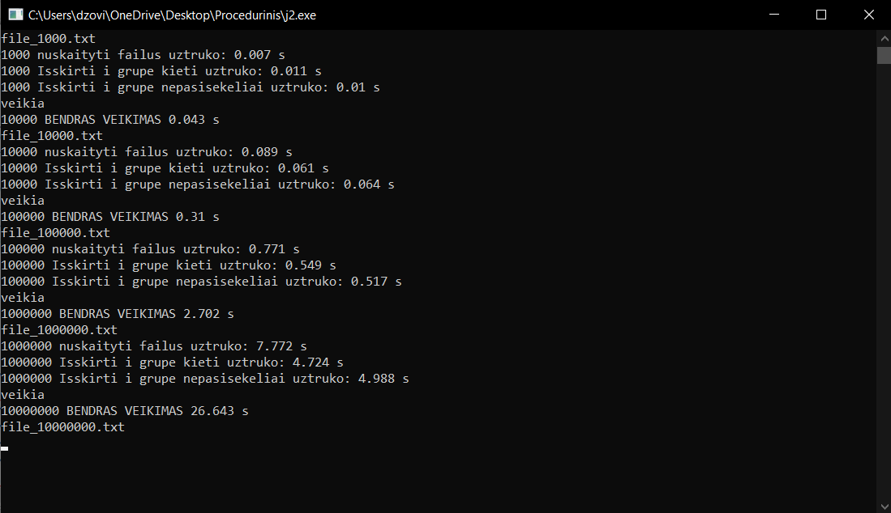
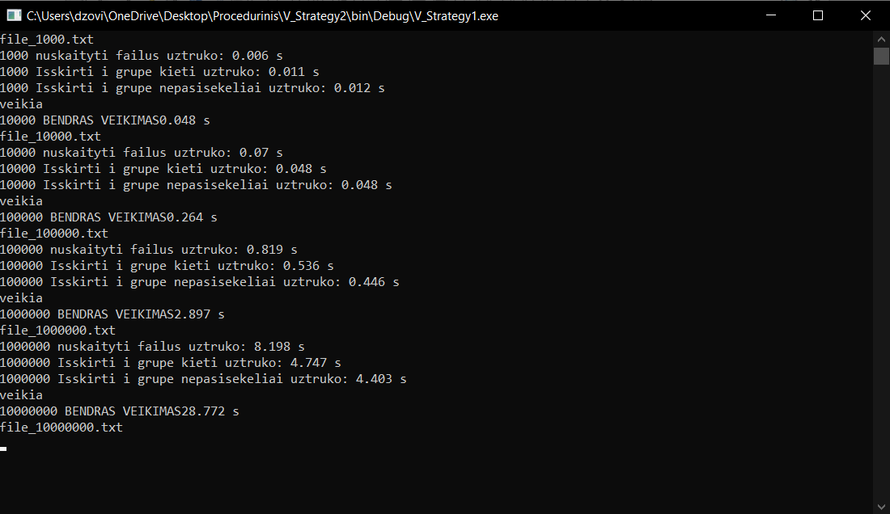
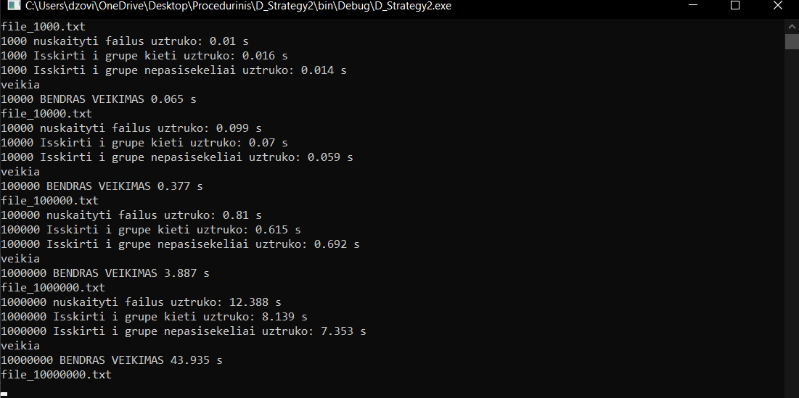
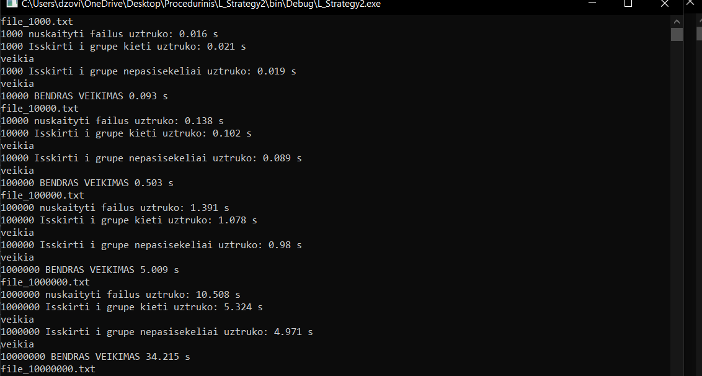
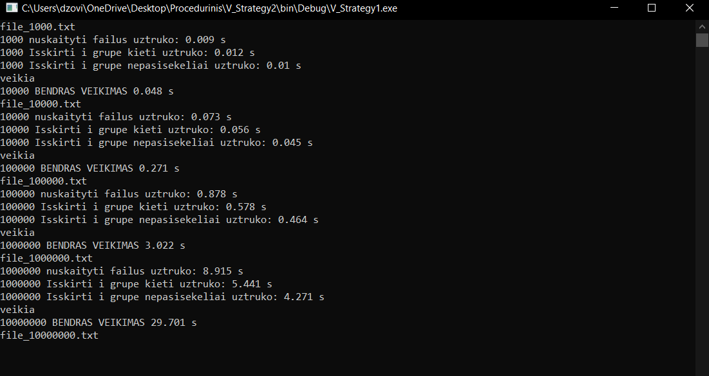

# Antra-Uzduotis

## v0.1

Ši programa įvedus mokinių skaičių paprašo ar norėsi skaičiuoti pagal medianą ar pagal namų darbus. Tada paprašo vardo ir pavardės. Po to vartotojas pasirenka ar nori random rezultatų ar paties įvestų. Tada pagal pasirinkimą arba veda rezultatus: egzamino ir namų darbų. 

Tada Galutini balą apskaičiuoja pagal formulę: Galutinis balas = 0.4 * Vidurkis/mediana + 0.6 * egzaminas

Programa sukurta buvo naudojant vienoje versijoje masyvus kitoje vektorius

Ši programa atsižvelgia ar vartotojas teisingai įveda skaičius ar tai nėra raidės ir pnš. Žiūri, kad skaičiai nebūtų po kablelio, neperžengtų ribų. 

## v0.2 

Šioje versijoje galima pasirinkti ar duomenys būtų skaitomi iš failo, kuris yra tame pačiame folderyje arba duomenys yra įvedami ranka, kaip versijoje v0.1.

## v0.3

Šitoje versijoje funkcijos perkeltos į headeri ir pridėti exceptionai

## v0.4

Šitoje versijoje pati programa atsitiktine tvarka sukuria studentų sąrašus: 1000, 10000, 100000, 1000000, 10000000; Jiems yra sukurti ir atsitiktine tvarka sudaryti pažymiai bei egzaminų įvertinimai. Prie šios versijos yra pridėtas ir kiekvienos atliekamos procedūros, jos veikimo laikas. Bei apskaičiuojamas bendras laikas, darbo su failu.

## v0.5

Šioje versijoje testuojame įvairius konteinerius ir žiūrime su kuriais darbas bus atliktas greičiausiai. Kodas panaudotas ir pakoreaguotas versijos v0.4. Kompiuterio parametrai: procesorius - Intel i7-8750H, 16GB RAM, KXG60ZNV512G NVMe TOSHIBA 512GB.

### Darbas su vektoriais

Kai programa naudoja vektorių konteinerį, ji skaito failus greičiau nei List konteineris, bet duomenis skirsto į dvi grupes lėčiau.

### Darbas su deque

Kai programa naudoja deque konteinerį, šis konteineris dirba lėčiausiai iš visų naudojamų.

### Darbas su list

Kai programa naudoja List konteinerį, ji skaito failus lėčiau nei vektor konteineris, bet duomenis skirsto į dvi grupes greičiau.

## v1.0

Šioje versijoje buvo bandoma optimizuoti programą naudojant įvairias strategijas. Viena iš jų - sukurti du atskirus konteinerius, vienas kietiakams, kitas vargšiukams. Kita strategija sukurti tik vieną konteinerį - kietiakai. Tada gauname atskirtus kietiakus, kurių vidurkis didesnis arba lygus penkiems. O studentų konteineryje lieka vargšiukai, kurių galutinis balas prastesnis. 
Čia bus palyginama pirma su antra strategijos.

### Strategijų palyginimas su Vektoriais

### Strategijų palyginimas su Deque

### Strategijų palyginimas su List

Matome, kad visais atvejais 2 strategija dirba veikia ilgiau nei pirma strategija

## v1.1

## Naudojimosi instrukcija

Parsisiųsti failus, įsijungti UNIX. Terminale parašyti make ir atidaryti makefile, baigus parašyti make clean.
